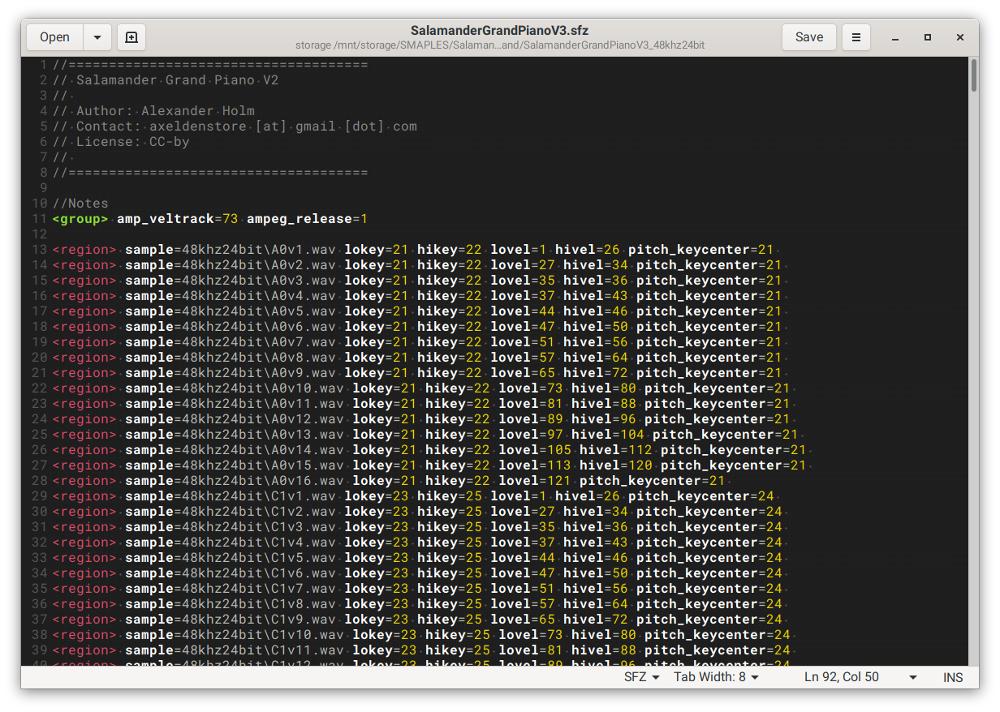

# SFZ Format Filetype Syntax Highlighting for gedit

This [gedit](https://wiki.gnome.org/Apps/Gedit) configuration file will add syntax highlighting for [SFZ Format](https://sfzformat.com) file type.

## Installation

- Copy `sfz.lang` to directory, (create if non-existant in system):
`$HOME/.local/share/gtksourceview-4/language-specs/`

## Kown Bugs

- Opcode values are not currently highlighted

- Sample filenames are not correctly highlighted- if an opcode name is used in a filename, such as `sample=sample.wav` both will be highlighted

- Opcode keyword list is not complete for SFZv2 Cakewalk

## Future Work

- Generate `sfz.lang` using external sfz opcode list

- Fix known bugs
